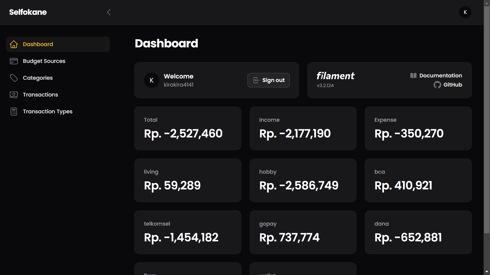
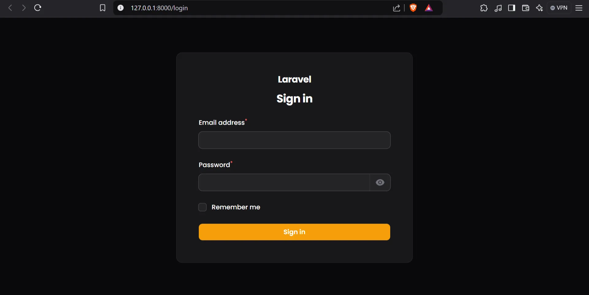

# Selfokane

## 💭 Why Selfokane Exist?

Why Selfokane exist?

The developer who create this program always spend too much money on something he didn’t know. He didn’t know why his money lost too much. So, he want to know the flow of his money.

Why The developer didn’t find another Money Management App?

The developer knowledge about money was small and he’s not learn much about Economy. So, he want create simple thing rather than use complex thing. 

Is it worth it?

My preference is not absolute. I know some application very worth it rather than Selfokane. So, if you want, you can use it.

## 🤔 What Can I do?

You can write your income and expense. Is not app that has super feature. Only normal feature in simple way.

### Dashboard



You can see how much your money.

### Budget Source


Some list of your budget source.

### Category


Category transaction. Is it for hobby? For living? Giving to your family? or…

### Transaction


You can write transaction 

### Transaction Type


Honestly, this feature only use ‘income’ and ‘expense’.

## ❓ Another Why?

Why the developer didn’t use Excel or Spreadsheet?
The developer too lazy to use Excel and Spreadsheet. Maybe, he feels “I wanna create new application for my portfolio.”.

## 🛠️ How to Install

Clone repo.

```bash
git clone https://github.com/ZhafranBahij/selfokane.git
```

Go to repo

```bash
cd selfokane
```

Copy .env.example to .env

```bash
cp .env.example .env
```

Install

```bash
composer install
```

Setting Database in .env . You can use anything you want, but I’m use MySQL.

```
DB_CONNECTION=mysql
DB_HOST=127.0.0.1
DB_PORT=3306
DB_DATABASE=selfokanev2
DB_USERNAME=root
DB_PASSWORD=
```

Generate key in .env

```bash
php artisan key:generate
```

Migrate database

```bash
php artisan migrate
```

Seed data

```bash
php artisan db:seed
```

Activate the web in localhost. This step is opsional if you know to activate it via Laragon, Laravel Herd, etc.

```bash
php artisan serve
```



## 🤖 Technology

- Laravel Filament

## 🗒️Note

- The value of ‘expense’ in Transaction always below zero in reality. Because the developer too lazy to calculate transaction thing in dashboard.
- In screenshot, data is dummy.
